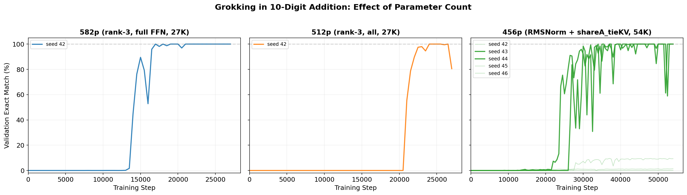

# A 456-Parameter Transformer Solves 10-Digit Addition

A **456-parameter** transformer that solves 10-digit integer addition. Given two integers A, B in [0, 10^10), the model predicts C = A + B autoregressively, achieving **100% exact-match accuracy** on 100,000 test examples.

Building on [smallest-addition-transformer-codex](https://github.com/anadim/smallest-addition-transformer-codex) (1,644 params) and [gpt-acc-jax](https://github.com/yhavinga/gpt-acc-jax) (777 params), we introduce **low-rank factorization** (W = AB, rank 3) to reduce the model to 512 parameters. [digit-addition-491p](https://github.com/rezabyt/digit-addition-491p) then replaced LayerNorm with **RMSNorm w/o bias** to reach 491 parameters. We build on this and add two further techniques to reach **456 parameters**:
- **Shared-A tied-KV QKV**: In the low-rank QKV factorization (Q, K, V = h·Bq, h·Bk, h·Bv where h = x·A), we tie Bk = Bv so that K = V, reducing from 3 B-matrices to 2 (saves 21 parameters).
- **Rank-2 attention output**: Attention output projection reduced from rank 3 to rank 2 (saves 14 parameters).


## Grokking

All successful models exhibit **grokking**: prolonged near-zero accuracy followed by a sudden phase transition.




## Leaderboard

| Params | Model | Accuracy | Reference |
|---|---|---|---|
| 1,644 | Codex baseline | 99.04% | [Papailiopoulos](https://github.com/anadim/smallest-addition-transformer-codex) |
| 777 | gpt-acc-jax (pico-7d-ff14-lr02) | 99.69% | [Havinga](https://github.com/yhavinga/gpt-acc-jax) |
| 512 | + Low-rank factorization (rank 3) | 99.988% | Ours |
| 491 | + RMSNorm w/o bias | 99.97% | [rezabyt](https://github.com/rezabyt/digit-addition-491p) |
| **456** | **+ shareA_tieKV + rank-2 attn output** | **100%** | **Ours** |

## Architecture

Single-layer, single-head, decoder-only transformer with d_model=7, d_ff=14, vocabulary size 14 (digits 0-9, `+`, `=`, `<PAD>`, `<EOS>`).

| Component | Factorization | Params |
|---|---|---|
| Token embedding (tied) | 14 × 7 | 98 |
| Position embedding (rank-3) | 33×3 + 3×7 | 120 |
| RMSNorm (pre-attn) | weight only | 7 |
| QKV (shareA_tieKV, r=3) | A: 7×3; Bq: 3×7; Bkv: 3×7 | 63 |
| Attention output (r=2) | 7×2 + 2×7 | 28 |
| RMSNorm (pre-FFN) | weight only | 7 |
| FFN up (r=3) | 7×3 + 3×14 | 63 |
| FFN down (r=3) | 14×3 + 3×7 | 63 |
| Final RMSNorm | weight only | 7 |
| Output head | (tied with token embedding) | 0 |
| **Total** | | **456** |

## Results

Evaluated on 10 independent test sets of 10,000 examples each (100,000 total), with seeds disjoint from training:

| Model | Params | Exact Match | Errors / 100K |
|---|---|---|---|
| 582p (seed 42) | 582 | 99.999% | 1 |
| 512p (seed 42) | 512 | 99.988% | 12 |
| **456p (seed 43)** | **456** | **100%** | **0** |
| 456p (seed 44) | 456 | 99.958% | 42 |


## Quick Start

### Install

```bash
pip install torch==2.10.0
```

### Evaluate Pre-trained Checkpoint

```bash
python evaluate_checkpoints.py \
  checkpoints/best_456p_s43.pt --device cuda
```

### Single Prediction

```bash
python -m src.eval predict \
  --ckpt checkpoints/best_456p_s43.pt \
  --a 1234567890 --b 9876543210
```

### Train from Scratch

```bash
# 456-param model (best: seed 43)
python -m src.train \
  --run-name best_456 \
  --pos-rank 3 --qkv-rank 3 --attn-out-rank 2 --ffn-rank 3 \
  --use-rmsnorm --tie-qkv shareA_tieKV \
  --total-steps 54000 --device cuda --seed 43

# 512-param model
python -m src.train \
  --run-name best_512 \
  --pos-rank 3 --qkv-rank 3 --attn-out-rank 3 --ffn-rank 3 \
  --device cuda --seed 42
```

## Training

3-phase curriculum following [gpt-acc-jax](https://github.com/yhavinga/gpt-acc-jax):
1. Steps 0-2,000: 1-3 digit operands
2. Steps 2,000-7,000: 1-6 digit operands
3. Steps 7,000-54,000: 1-10 digit operands (full range)

AdamW optimizer, peak LR = 0.02, linear warmup (1,350 steps) + cosine decay, min LR = 0.002, weight decay = 0.01, batch size = 512, total steps = 54,000.

All successful models exhibit **grokking**: prolonged near-zero accuracy followed by a sudden phase transition. For the 456-parameter model, 2 out of 5 random seeds (43 and 44) grokked within 54K steps.

## Files

```
src/
  model.py    # Low-rank transformer (RMSNorm, shareA_tieKV, LowRankLinear)
  data.py     # Raw digit tokenization pipeline
  train.py    # Training with curriculum learning
  eval.py     # Evaluation and inference
checkpoints/
  best_456p_s43.pt   # Best model (456 params, 100% on 100K)
  best_456p_s44.pt   # 456 params, 99.958% on 100K
  best_512params.pt  # 512 params, 99.988% on 100K
  best_582params.pt  # 582 params, 99.999% on 100K
evaluate_checkpoints.py  # Multi-seed evaluation script
report.pdf               # Technical report
```

## References

- D. Papailiopoulos, "Glove box challenge: smallest transformer for 10-digit addition," 2026. [GitHub](https://github.com/anadim/smallest-addition-transformer-codex)
- Y. Havinga, "gpt-acc-jax: Smallest GPT for 10-digit addition," 2026. [GitHub](https://github.com/yhavinga/gpt-acc-jax)
- rezabyt, "digit-addition-491p," 2026. [GitHub](https://github.com/rezabyt/digit-addition-491p)
